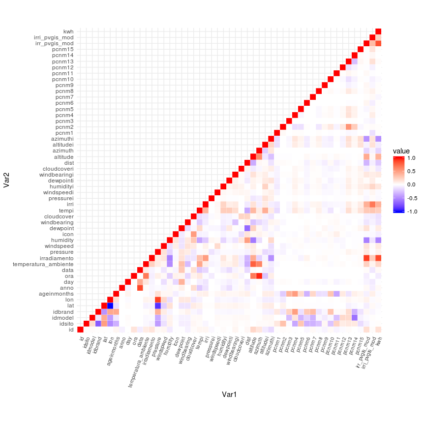
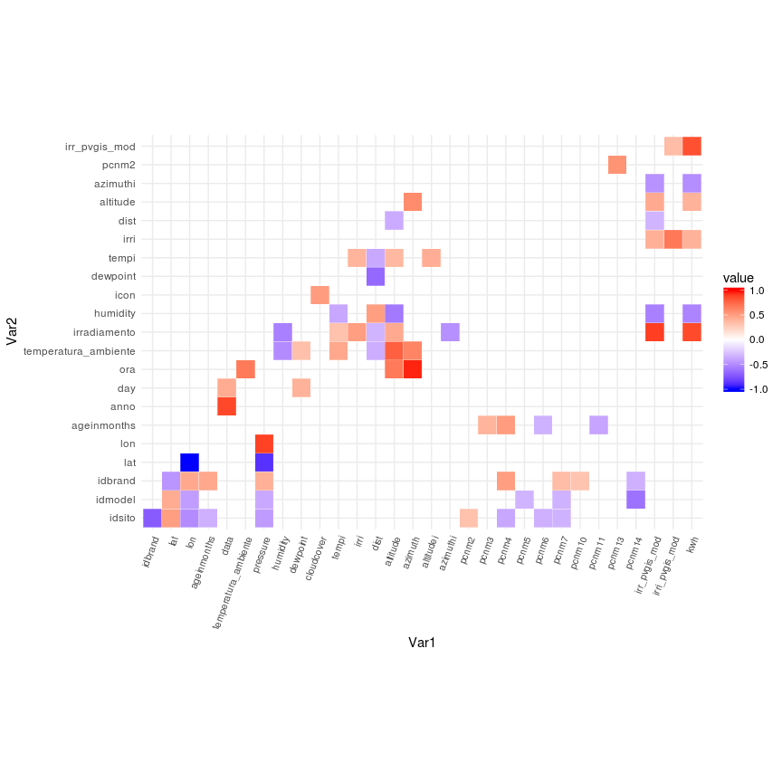
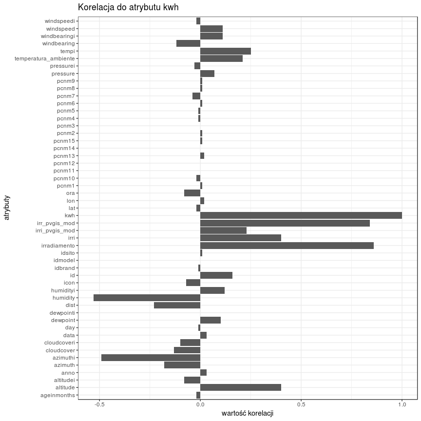
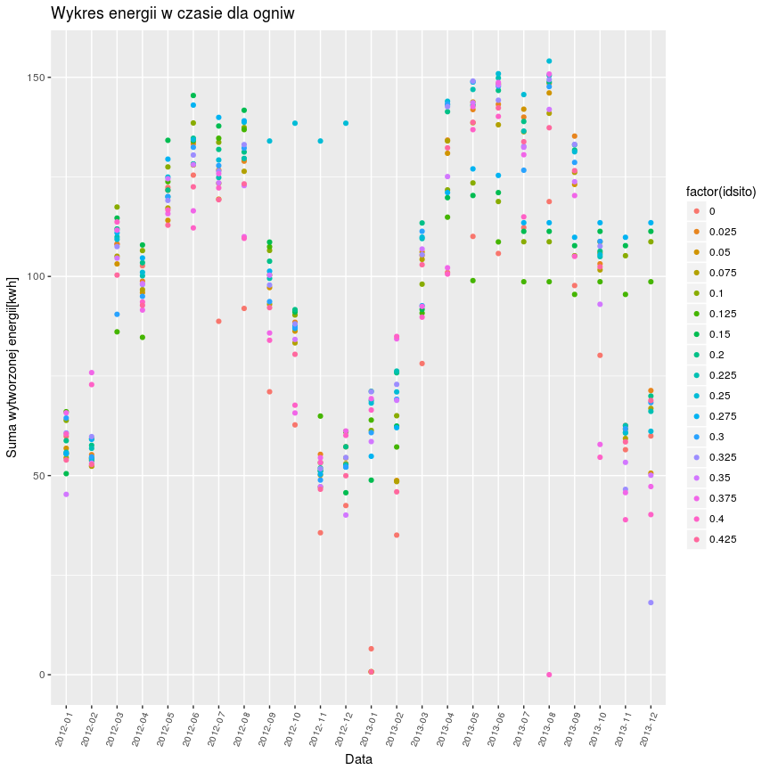

Projekt analiza danych
================
Wojciech Mikołajczyk
December 2, 2017

-   [TODO: rozdział podsumowujący
    analizę](#todo-rozdział-podsumowujący-analizę)
-   [Wykorzystane biblioteki](#wykorzystane-biblioteki)
-   [Wczytanie danych z pliku](#wczytanie-danych-z-pliku)
-   [Krótkie podsumowanie danych w
    zbiorze](#krótkie-podsumowanie-danych-w-zbiorze)
-   [Opis kolumn](#opis-kolumn)
-   [Brakujące wartości - ciągi 0 w różnych kolumnach, tylko
    pressure](#brakujące-wartości---ciągi-0-w-różnych-kolumnach-tylko-pressure)
-   [Korelacja między zmiennymi](#korelacja-między-zmiennymi)

### TODO: rozdział podsumowujący analizę

### Wykorzystane biblioteki

``` r
library(dplyr)
library(ggplot2)
library(reshape2)
library(caret)
```

### Wczytanie danych z pliku

``` r
data <- read.csv('elektrownie.csv')
```

### Krótkie podsumowanie danych w zbiorze

##### Sprawdzenie czy zbiór danych zawiera wartości NA

``` r
any(is.na(data))
```

    ## [1] FALSE

Liczba wartości zerowych w kolumnach

``` r
sapply(data, function(x) sum(x==0))
```

    ##                   id               idsito              idmodel 
    ##                    0                13870                13870 
    ##              idbrand                  lat                  lon 
    ##                41610                    0                    0 
    ##          ageinmonths                 anno                  day 
    ##                69350                    0                  304 
    ##                  ora                 data temperatura_ambiente 
    ##                12410                    0                    0 
    ##         irradiamento             pressure            windspeed 
    ##                78489                32148                 1070 
    ##             humidity                 icon             dewpoint 
    ##                    0                45617                    0 
    ##          windbearing           cloudcover                tempi 
    ##                 2520                38394                    0 
    ##                 irri            pressurei           windspeedi 
    ##                    0               233263                    2 
    ##            humidityi            dewpointi         windbearingi 
    ##                    0                    0                    1 
    ##          cloudcoveri                 dist             altitude 
    ##                    1                  570                    0 
    ##              azimuth            altitudei             azimuthi 
    ##                    0                    1                    1 
    ##                pcnm1                pcnm2                pcnm3 
    ##                13870                13870                13870 
    ##                pcnm4                pcnm5                pcnm6 
    ##                13870                13870                13870 
    ##                pcnm7                pcnm8                pcnm9 
    ##                13870                13870                13870 
    ##               pcnm10               pcnm11               pcnm12 
    ##                13870                13870                13870 
    ##               pcnm13               pcnm14               pcnm15 
    ##                    0                13870                13870 
    ##        irr_pvgis_mod       irri_pvgis_mod                  kwh 
    ##                94008                    2                78521

##### Podstawowe statystyki

``` r
summary(data)
```

    ##        id             idsito          idmodel          idbrand      
    ##  Min.   :     1   Min.   :0.0000   Min.   :0.0000   Min.   :0.0000  
    ##  1st Qu.: 99646   1st Qu.:0.1000   1st Qu.:0.1670   1st Qu.:0.0830  
    ##  Median :158594   Median :0.2250   Median :0.2080   Median :0.1670  
    ##  Mean   :152703   Mean   :0.2147   Mean   :0.2426   Mean   :0.1519  
    ##  3rd Qu.:217541   3rd Qu.:0.3250   3rd Qu.:0.2920   3rd Qu.:0.1670  
    ##  Max.   :276488   Max.   :0.4250   Max.   :0.7500   Max.   :0.4170  
    ##                                                                     
    ##       lat              lon          ageinmonths          anno     
    ##  Min.   :0.4150   Min.   :0.1540   Min.   :0.0000   Min.   :2012  
    ##  1st Qu.:0.4370   1st Qu.:0.6200   1st Qu.:0.0000   1st Qu.:2012  
    ##  Median :0.4370   Median :0.6240   Median :0.1250   Median :2012  
    ##  Mean   :0.4495   Mean   :0.5711   Mean   :0.3145   Mean   :2012  
    ##  3rd Qu.:0.4390   3rd Qu.:0.6300   3rd Qu.:0.7190   3rd Qu.:2013  
    ##  Max.   :0.5530   Max.   :0.6910   Max.   :1.0000   Max.   :2013  
    ##                                                                   
    ##       day              ora                      data       
    ##  Min.   :0.0000   Min.   :0.000   10/10/2012 10:00:    17  
    ##  1st Qu.:0.2520   1st Qu.:0.222   10/10/2012 11:00:    17  
    ##  Median :0.4770   Median :0.500   10/10/2012 12:00:    17  
    ##  Mean   :0.4812   Mean   :0.500   10/10/2012 13:00:    17  
    ##  3rd Qu.:0.7100   3rd Qu.:0.778   10/10/2012 14:00:    17  
    ##  Max.   :1.0000   Max.   :1.000   10/10/2012 15:00:    17  
    ##                                   (Other)         :235688  
    ##  temperatura_ambiente  irradiamento       pressure        windspeed      
    ##  Min.   :0.0450       Min.   :0.0000   Min.   :0.0000   Min.   :0.00000  
    ##  1st Qu.:0.2120       1st Qu.:0.0000   1st Qu.:0.7480   1st Qu.:0.04200  
    ##  Median :0.3480       Median :0.0350   Median :0.7530   Median :0.06600  
    ##  Mean   :0.3734       Mean   :0.1091   Mean   :0.6504   Mean   :0.07622  
    ##  3rd Qu.:0.5300       3rd Qu.:0.2040   3rd Qu.:0.7550   3rd Qu.:0.10200  
    ##  Max.   :0.8180       Max.   :0.7100   Max.   :0.7690   Max.   :0.69600  
    ##                                                                          
    ##     humidity           icon           dewpoint       windbearing    
    ##  Min.   :0.1600   Min.   :0.0000   Min.   :0.1390   Min.   :0.0000  
    ##  1st Qu.:0.5400   1st Qu.:0.0830   1st Qu.:0.5350   1st Qu.:0.3000  
    ##  Median :0.7000   Median :0.6670   Median :0.6190   Median :0.4780  
    ##  Mean   :0.6844   Mean   :0.4623   Mean   :0.6055   Mean   :0.4512  
    ##  3rd Qu.:0.8400   3rd Qu.:0.6670   3rd Qu.:0.6830   3rd Qu.:0.6600  
    ##  Max.   :1.0000   Max.   :0.7500   Max.   :0.8650   Max.   :0.7690  
    ##                                                                     
    ##    cloudcover        tempi             irri         pressurei       
    ##  Min.   :0.000   Min.   :0.0090   Min.   :0.108   Min.   :0.000000  
    ##  1st Qu.:0.230   1st Qu.:0.0730   1st Qu.:0.216   1st Qu.:0.000000  
    ##  Median :0.310   Median :0.1110   Median :0.220   Median :0.000000  
    ##  Mean   :0.359   Mean   :0.1225   Mean   :0.222   Mean   :0.000237  
    ##  3rd Qu.:0.510   3rd Qu.:0.1260   3rd Qu.:0.222   3rd Qu.:0.000000  
    ##  Max.   :1.000   Max.   :0.9830   Max.   :1.000   Max.   :1.000000  
    ##                                                                     
    ##    windspeedi        humidityi         dewpointi       windbearingi   
    ##  Min.   :0.00000   Min.   :0.03400   Min.   :0.0630   Min.   :0.0000  
    ##  1st Qu.:0.03700   1st Qu.:0.04400   1st Qu.:0.1140   1st Qu.:0.3360  
    ##  Median :0.03800   Median :0.04400   Median :0.1140   Median :0.3360  
    ##  Mean   :0.03852   Mean   :0.06384   Mean   :0.1194   Mean   :0.3455  
    ##  3rd Qu.:0.03900   3rd Qu.:0.06200   3rd Qu.:0.1180   3rd Qu.:0.3390  
    ##  Max.   :1.00000   Max.   :0.57900   Max.   :0.4150   Max.   :1.0000  
    ##                                                                       
    ##   cloudcoveri          dist           altitude         azimuth      
    ##  Min.   :0.0000   Min.   :0.0000   Min.   :0.1110   Min.   :0.1280  
    ##  1st Qu.:0.1960   1st Qu.:0.1913   1st Qu.:0.4190   1st Qu.:0.2950  
    ##  Median :0.1960   Median :0.4590   Median :0.5640   Median :0.4250  
    ##  Mean   :0.2062   Mean   :0.4686   Mean   :0.5464   Mean   :0.4546  
    ##  3rd Qu.:0.1980   3rd Qu.:0.7268   3rd Qu.:0.6810   3rd Qu.:0.6350  
    ##  Max.   :1.0000   Max.   :1.0000   Max.   :0.8840   Max.   :0.8180  
    ##                                                                     
    ##    altitudei         azimuthi          pcnm1            pcnm2       
    ##  Min.   :0.0000   Min.   :0.0000   Min.   :0.0000   Min.   :0.0000  
    ##  1st Qu.:0.0960   1st Qu.:0.2090   1st Qu.:0.3770   1st Qu.:0.2500  
    ##  Median :0.1360   Median :0.2880   Median :0.3780   Median :0.3770  
    ##  Mean   :0.2055   Mean   :0.3653   Mean   :0.4224   Mean   :0.3538  
    ##  3rd Qu.:0.2660   3rd Qu.:0.4820   3rd Qu.:0.3800   3rd Qu.:0.4220  
    ##  Max.   :0.9820   Max.   :1.0000   Max.   :1.0000   Max.   :0.9720  
    ##                                                                     
    ##      pcnm3            pcnm4            pcnm5            pcnm6       
    ##  Min.   :0.0000   Min.   :0.0000   Min.   :0.0000   Min.   :0.0000  
    ##  1st Qu.:0.5510   1st Qu.:0.3630   1st Qu.:0.3310   1st Qu.:0.3390  
    ##  Median :0.6050   Median :0.5310   Median :0.4270   Median :0.4930  
    ##  Mean   :0.6045   Mean   :0.5189   Mean   :0.4165   Mean   :0.4941  
    ##  3rd Qu.:0.7300   3rd Qu.:0.6340   3rd Qu.:0.4620   3rd Qu.:0.4930  
    ##  Max.   :1.0000   Max.   :1.0000   Max.   :1.0000   Max.   :1.0000  
    ##                                                                     
    ##      pcnm7            pcnm8            pcnm9            pcnm10      
    ##  Min.   :0.0000   Min.   :0.0000   Min.   :0.0000   Min.   :0.0000  
    ##  1st Qu.:0.0310   1st Qu.:0.2040   1st Qu.:0.5270   1st Qu.:0.5530  
    ##  Median :0.0520   Median :0.4120   Median :0.5320   Median :0.6190  
    ##  Mean   :0.1142   Mean   :0.4034   Mean   :0.5371   Mean   :0.6276  
    ##  3rd Qu.:0.1140   3rd Qu.:0.5110   3rd Qu.:0.6000   3rd Qu.:0.7170  
    ##  Max.   :1.0000   Max.   :1.0000   Max.   :1.0000   Max.   :1.0000  
    ##                                                                     
    ##      pcnm11           pcnm12           pcnm13           pcnm14      
    ##  Min.   :0.0000   Min.   :0.0000   Min.   :0.1370   Min.   :0.0000  
    ##  1st Qu.:0.2570   1st Qu.:0.7480   1st Qu.:0.6140   1st Qu.:0.4320  
    ##  Median :0.3270   Median :0.7600   Median :0.6140   Median :0.4730  
    ##  Mean   :0.3236   Mean   :0.7568   Mean   :0.6501   Mean   :0.4893  
    ##  3rd Qu.:0.3270   3rd Qu.:0.8840   3rd Qu.:0.7380   3rd Qu.:0.5300  
    ##  Max.   :1.0000   Max.   :1.0000   Max.   :1.0000   Max.   :1.0000  
    ##                                                                     
    ##      pcnm15       irr_pvgis_mod    irri_pvgis_mod         kwh        
    ##  Min.   :0.0000   Min.   :0.0000   Min.   :-0.0250   Min.   :0.0000  
    ##  1st Qu.:0.6120   1st Qu.:0.0000   1st Qu.: 0.1580   1st Qu.:0.0000  
    ##  Median :0.6140   Median :0.0560   Median : 0.1940   Median :0.0490  
    ##  Mean   :0.5709   Mean   :0.1767   Mean   : 0.1967   Mean   :0.1688  
    ##  3rd Qu.:0.6150   3rd Qu.:0.3250   3rd Qu.: 0.2130   3rd Qu.:0.3320  
    ##  Max.   :1.0000   Max.   :1.0000   Max.   : 1.0060   Max.   :1.0000  
    ## 

##### Liczba wierszy danych

``` r
nrow(data)
```

    ## [1] 235790

##### Liczba kolumn

``` r
ncol(data)
```

    ## [1] 51

##### Typy kolumn

``` r
pander::pander(sapply(data, class))
```

<table>
<caption>Table continues below</caption>
<colgroup>
<col width="13%" />
<col width="13%" />
<col width="13%" />
<col width="13%" />
<col width="13%" />
<col width="13%" />
<col width="17%" />
</colgroup>
<thead>
<tr class="header">
<th align="center">id</th>
<th align="center">idsito</th>
<th align="center">idmodel</th>
<th align="center">idbrand</th>
<th align="center">lat</th>
<th align="center">lon</th>
<th align="center">ageinmonths</th>
</tr>
</thead>
<tbody>
<tr class="odd">
<td align="center">integer</td>
<td align="center">numeric</td>
<td align="center">numeric</td>
<td align="center">numeric</td>
<td align="center">numeric</td>
<td align="center">numeric</td>
<td align="center">numeric</td>
</tr>
</tbody>
</table>

<table>
<caption>Table continues below</caption>
<colgroup>
<col width="13%" />
<col width="13%" />
<col width="13%" />
<col width="11%" />
<col width="30%" />
<col width="18%" />
</colgroup>
<thead>
<tr class="header">
<th align="center">anno</th>
<th align="center">day</th>
<th align="center">ora</th>
<th align="center">data</th>
<th align="center">temperatura_ambiente</th>
<th align="center">irradiamento</th>
</tr>
</thead>
<tbody>
<tr class="odd">
<td align="center">integer</td>
<td align="center">numeric</td>
<td align="center">numeric</td>
<td align="center">factor</td>
<td align="center">numeric</td>
<td align="center">numeric</td>
</tr>
</tbody>
</table>

<table style="width:94%;">
<caption>Table continues below</caption>
<colgroup>
<col width="15%" />
<col width="16%" />
<col width="15%" />
<col width="13%" />
<col width="15%" />
<col width="18%" />
</colgroup>
<thead>
<tr class="header">
<th align="center">pressure</th>
<th align="center">windspeed</th>
<th align="center">humidity</th>
<th align="center">icon</th>
<th align="center">dewpoint</th>
<th align="center">windbearing</th>
</tr>
</thead>
<tbody>
<tr class="odd">
<td align="center">numeric</td>
<td align="center">numeric</td>
<td align="center">numeric</td>
<td align="center">numeric</td>
<td align="center">numeric</td>
<td align="center">numeric</td>
</tr>
</tbody>
</table>

<table style="width:99%;">
<caption>Table continues below</caption>
<colgroup>
<col width="18%" />
<col width="13%" />
<col width="13%" />
<col width="16%" />
<col width="18%" />
<col width="18%" />
</colgroup>
<thead>
<tr class="header">
<th align="center">cloudcover</th>
<th align="center">tempi</th>
<th align="center">irri</th>
<th align="center">pressurei</th>
<th align="center">windspeedi</th>
<th align="center">humidityi</th>
</tr>
</thead>
<tbody>
<tr class="odd">
<td align="center">numeric</td>
<td align="center">numeric</td>
<td align="center">numeric</td>
<td align="center">numeric</td>
<td align="center">numeric</td>
<td align="center">numeric</td>
</tr>
</tbody>
</table>

<table>
<caption>Table continues below</caption>
<colgroup>
<col width="16%" />
<col width="20%" />
<col width="19%" />
<col width="13%" />
<col width="15%" />
<col width="15%" />
</colgroup>
<thead>
<tr class="header">
<th align="center">dewpointi</th>
<th align="center">windbearingi</th>
<th align="center">cloudcoveri</th>
<th align="center">dist</th>
<th align="center">altitude</th>
<th align="center">azimuth</th>
</tr>
</thead>
<tbody>
<tr class="odd">
<td align="center">numeric</td>
<td align="center">numeric</td>
<td align="center">numeric</td>
<td align="center">numeric</td>
<td align="center">numeric</td>
<td align="center">numeric</td>
</tr>
</tbody>
</table>

<table style="width:100%;">
<caption>Table continues below</caption>
<colgroup>
<col width="16%" />
<col width="15%" />
<col width="13%" />
<col width="13%" />
<col width="13%" />
<col width="13%" />
<col width="13%" />
</colgroup>
<thead>
<tr class="header">
<th align="center">altitudei</th>
<th align="center">azimuthi</th>
<th align="center">pcnm1</th>
<th align="center">pcnm2</th>
<th align="center">pcnm3</th>
<th align="center">pcnm4</th>
<th align="center">pcnm5</th>
</tr>
</thead>
<tbody>
<tr class="odd">
<td align="center">numeric</td>
<td align="center">numeric</td>
<td align="center">numeric</td>
<td align="center">numeric</td>
<td align="center">numeric</td>
<td align="center">numeric</td>
<td align="center">numeric</td>
</tr>
</tbody>
</table>

<table>
<caption>Table continues below</caption>
<colgroup>
<col width="12%" />
<col width="12%" />
<col width="12%" />
<col width="12%" />
<col width="12%" />
<col width="12%" />
<col width="12%" />
<col width="12%" />
</colgroup>
<thead>
<tr class="header">
<th align="center">pcnm6</th>
<th align="center">pcnm7</th>
<th align="center">pcnm8</th>
<th align="center">pcnm9</th>
<th align="center">pcnm10</th>
<th align="center">pcnm11</th>
<th align="center">pcnm12</th>
<th align="center">pcnm13</th>
</tr>
</thead>
<tbody>
<tr class="odd">
<td align="center">numeric</td>
<td align="center">numeric</td>
<td align="center">numeric</td>
<td align="center">numeric</td>
<td align="center">numeric</td>
<td align="center">numeric</td>
<td align="center">numeric</td>
<td align="center">numeric</td>
</tr>
</tbody>
</table>

<table style="width:86%;">
<colgroup>
<col width="13%" />
<col width="13%" />
<col width="22%" />
<col width="23%" />
<col width="12%" />
</colgroup>
<thead>
<tr class="header">
<th align="center">pcnm14</th>
<th align="center">pcnm15</th>
<th align="center">irr_pvgis_mod</th>
<th align="center">irri_pvgis_mod</th>
<th align="center">kwh</th>
</tr>
</thead>
<tbody>
<tr class="odd">
<td align="center">numeric</td>
<td align="center">numeric</td>
<td align="center">numeric</td>
<td align="center">numeric</td>
<td align="center">numeric</td>
</tr>
</tbody>
</table>

##### Liczba różnych wartości kolumn

``` r
pander::pander(sapply(data, function(x) length(unique(x))))
```

<table>
<caption>Table continues below</caption>
<colgroup>
<col width="11%" />
<col width="11%" />
<col width="12%" />
<col width="12%" />
<col width="7%" />
<col width="7%" />
<col width="17%" />
<col width="8%" />
<col width="8%" />
</colgroup>
<thead>
<tr class="header">
<th align="center">id</th>
<th align="center">idsito</th>
<th align="center">idmodel</th>
<th align="center">idbrand</th>
<th align="center">lat</th>
<th align="center">lon</th>
<th align="center">ageinmonths</th>
<th align="center">anno</th>
<th align="center">day</th>
</tr>
</thead>
<tbody>
<tr class="odd">
<td align="center">235790</td>
<td align="center">17</td>
<td align="center">11</td>
<td align="center">6</td>
<td align="center">9</td>
<td align="center">12</td>
<td align="center">7</td>
<td align="center">2</td>
<td align="center">365</td>
</tr>
</tbody>
</table>

<table>
<caption>Table continues below</caption>
<colgroup>
<col width="8%" />
<col width="10%" />
<col width="31%" />
<col width="20%" />
<col width="14%" />
<col width="14%" />
</colgroup>
<thead>
<tr class="header">
<th align="center">ora</th>
<th align="center">data</th>
<th align="center">temperatura_ambiente</th>
<th align="center">irradiamento</th>
<th align="center">pressure</th>
<th align="center">windspeed</th>
</tr>
</thead>
<tbody>
<tr class="odd">
<td align="center">19</td>
<td align="center">13870</td>
<td align="center">52</td>
<td align="center">639</td>
<td align="center">41</td>
<td align="center">367</td>
</tr>
</tbody>
</table>

<table>
<caption>Table continues below</caption>
<colgroup>
<col width="15%" />
<col width="9%" />
<col width="15%" />
<col width="19%" />
<col width="18%" />
<col width="11%" />
<col width="11%" />
</colgroup>
<thead>
<tr class="header">
<th align="center">humidity</th>
<th align="center">icon</th>
<th align="center">dewpoint</th>
<th align="center">windbearing</th>
<th align="center">cloudcover</th>
<th align="center">tempi</th>
<th align="center">irri</th>
</tr>
</thead>
<tbody>
<tr class="odd">
<td align="center">85</td>
<td align="center">7</td>
<td align="center">634</td>
<td align="center">360</td>
<td align="center">101</td>
<td align="center">522</td>
<td align="center">236</td>
</tr>
</tbody>
</table>

<table>
<caption>Table continues below</caption>
<colgroup>
<col width="15%" />
<col width="16%" />
<col width="15%" />
<col width="15%" />
<col width="18%" />
<col width="18%" />
</colgroup>
<thead>
<tr class="header">
<th align="center">pressurei</th>
<th align="center">windspeedi</th>
<th align="center">humidityi</th>
<th align="center">dewpointi</th>
<th align="center">windbearingi</th>
<th align="center">cloudcoveri</th>
</tr>
</thead>
<tbody>
<tr class="odd">
<td align="center">47</td>
<td align="center">126</td>
<td align="center">409</td>
<td align="center">183</td>
<td align="center">514</td>
<td align="center">393</td>
</tr>
</tbody>
</table>

<table>
<caption>Table continues below</caption>
<colgroup>
<col width="9%" />
<col width="14%" />
<col width="13%" />
<col width="16%" />
<col width="14%" />
<col width="10%" />
<col width="10%" />
<col width="10%" />
</colgroup>
<thead>
<tr class="header">
<th align="center">dist</th>
<th align="center">altitude</th>
<th align="center">azimuth</th>
<th align="center">altitudei</th>
<th align="center">azimuthi</th>
<th align="center">pcnm1</th>
<th align="center">pcnm2</th>
<th align="center">pcnm3</th>
</tr>
</thead>
<tbody>
<tr class="odd">
<td align="center">184</td>
<td align="center">773</td>
<td align="center">689</td>
<td align="center">935</td>
<td align="center">937</td>
<td align="center">11</td>
<td align="center">16</td>
<td align="center">13</td>
</tr>
</tbody>
</table>

<table>
<caption>Table continues below</caption>
<colgroup>
<col width="10%" />
<col width="10%" />
<col width="10%" />
<col width="10%" />
<col width="10%" />
<col width="10%" />
<col width="12%" />
<col width="12%" />
<col width="12%" />
</colgroup>
<thead>
<tr class="header">
<th align="center">pcnm4</th>
<th align="center">pcnm5</th>
<th align="center">pcnm6</th>
<th align="center">pcnm7</th>
<th align="center">pcnm8</th>
<th align="center">pcnm9</th>
<th align="center">pcnm10</th>
<th align="center">pcnm11</th>
<th align="center">pcnm12</th>
</tr>
</thead>
<tbody>
<tr class="odd">
<td align="center">13</td>
<td align="center">13</td>
<td align="center">12</td>
<td align="center">13</td>
<td align="center">13</td>
<td align="center">13</td>
<td align="center">13</td>
<td align="center">13</td>
<td align="center">13</td>
</tr>
</tbody>
</table>

<table style="width:90%;">
<colgroup>
<col width="12%" />
<col width="12%" />
<col width="12%" />
<col width="22%" />
<col width="23%" />
<col width="6%" />
</colgroup>
<thead>
<tr class="header">
<th align="center">pcnm13</th>
<th align="center">pcnm14</th>
<th align="center">pcnm15</th>
<th align="center">irr_pvgis_mod</th>
<th align="center">irri_pvgis_mod</th>
<th align="center">kwh</th>
</tr>
</thead>
<tbody>
<tr class="odd">
<td align="center">13</td>
<td align="center">13</td>
<td align="center">11</td>
<td align="center">870</td>
<td align="center">752</td>
<td align="center">864</td>
</tr>
</tbody>
</table>

##### Rozkład wartości poszczególnych atrybutów

``` r
ggplot(data = melt(data), mapping = aes(x = value)) + 
  geom_histogram(bins=50) + 
  labs(title = "Rozkład wartości atrybutów") + 
  facet_wrap(~variable, ncol=4, scales = 'free_x') + 
  scale_x_continuous(labels = scales::comma) + 
  theme_bw()
```

    ## Using data as id variables


### Opis kolumn

Dane są z ogniw fotowoltaicznych umieszczonych we Włoszech, to tłumaczy
dlaczego część kolumn w pliku z danymi ma włoskie nazwy.  
Zbiór danych opisany jest przy użyciu 51 kolumn.  
Wszystkie kolumny poza kolumnami 'id', 'data' oraz 'anno' mają wartości
liczbowe i są znormalizowane.

id - identyfikator  
idsito - id miejsca  
idmodel - id modelu  
idbrand - id marki

idsito, idmodel i idbrand są znormalizowanymi identyfikatorami miejsca
modelu i marki  
liczba różnych wartości jakie przyjmują:

``` r
sapply(data[, names(data) %in% c('idsito', 'idmodel', 'idbrand')], function(x) length(unique(x)))
```

    ##  idsito idmodel idbrand 
    ##      17      11       6

Jest 17 jednostek fotowoltaicznych z których są zebrane pomiary, każda z
nich opisana jest marką i modelem oraz wiekiem w miesiącach idsito,
idmodel, idbrand, lat, lon, ageinmonths - opisją ogniwa fotowoltaiczne.
Wartości są znormalizowane

lat - lattitude, szerokość geograficzna ogniwa fotowoltaicznego  
lon - longitude, długość geograficzna ogniwa fotowoltaicznego  
ageinmonths - wiek ogniwa fotowoltaicznego  
anno - rok  
day - dzien (przyjmuje 365 różnych wartości, więc wszystko się zgadza)  
ora - teraz (0 dla godz. 2:00, rośnie do 1 dla godz 20:00 czyli końca
pomiarów) data - data i czas w formacie MM/DD/YYYY HH:MM, od 1/2/2012
2:00 do 12/31/2013 20:00  
pomiary są zapisane od 2:00 do 20:00 - dlaczego? przecież latem słońce
świeci dłużej  
można uzyskać ilość energii wytworzonej w ciągu godziny poprzez
grupowanie po dacie (suma wartości z kolumny kwh)  
dlaczego jest 17 wpisów na jedną godzinę? "Każdy wiersz w zbiorze danych
zawiera uśrednione informacje z jednej godziny pomiarów pojedynczej
jednostki fotowoltaicznej" - dlatego, że jest w sumie 17 jednostek
(idsito) temperatura\_ambiente - temperatura otoczenia, spodziewamy się,
że to może wpływać na wytwarzaną ilość energii  
irradiamento - promieniowanie, zera są możliwe - może być noc, ogniwo
może być w cieniu  
pressure - ciśnienie, tutaj nie powinno być wartości 0, uzupełnione
będzie średnią  
windspeed - prędkość wiatru, bardzo mało wartości zerowych, możliwe jest
że nie było wiatru, zostawiamy wartości 0  
humidity - wilgotność  
icon - ikona ?  
dewpoint - temperatura punktu rosy (znormalizowana)  
windbearing - łożysko wiatrowe ?  
cloud cover - zachmurzenie, może być zerowe, zostawiamy wartości 0  
tempi -&gt; cloudcoveri - duplikacja kolumn temperatura\_ambiente -&gt;
cloudcover tylko kolumny nazwane po włosku? - inne wartości, dodane 'i'
na końcu - co oznacza ?  
dist - distance ?  
altitude - wysokość  
azimuth - azymut  
altitudei -&gt; azimuthi - odpowiedniki włoskie altitude i azimuth -
inne wartości  
pcnm1 -&gt; pcnm15 - jakieś pomiary z jakichś czujników, mają tyle samo
zer ile idsito i idmodel (wyjątkiem jest pcnm13) co może wskazywać że są
powiązane z czujnikami, odpowiednim ogniwom odpowiadają powtarzające się
wartości  
irr\_pvgis\_mod - ?  
irri\_pvgis\_mod - ?  
kwh - wytworzone Kilowatogodziny (wartości znormalizowane)

### Brakujące wartości - ciągi 0 w różnych kolumnach, tylko pressure

``` r
data$pressure <- ifelse(data$pressure == 0, mean(data$pressure), data$pressure)
```

##### Przetworzenie daty na wartość liczbową

``` r
data2 <- data
data2$data <- as.numeric(as.POSIXct(data2$data, format="%m/%d/%Y %H:%M"))
```

### Korelacja między zmiennymi

Odfiltrowanie daty, aby zostały same numeryczne wartości  
Macierz korelacji jest symetryczna, więc dla czytelności usuwamy górny
trójkąt

``` r
correlations <- round(cor(data2), 2)
correlations[upper.tri(correlations)] <- NA
correlations_melt <- melt(correlations, na.rm = TRUE)

ggplot(data = correlations_melt, aes(Var1, Var2, fill = value)) + 
  geom_tile(color = "white") + 
  labs(title = "Korelacja atrybutów", x = "Atrybuty", y = "Wartość korelacji") + 
  scale_fill_gradient2(low="blue", mid="white", high="red", midpoint=0, limit=c(-1,1)) + 
  theme_minimal() + 
  theme(axis.text.x = element_text(angle = 70, size = 8, vjust = 1, hjust = 1)) +
  coord_fixed()
```



##### Kolejny wykres korelacji - tym razem tylko dla skorelowanych dodanio / ujmenie powyżej pewnego progu

``` r
top_correlatinons <- correlations_melt %>% filter(abs(value) > 0.3, Var1 != Var2)
ggplot(data = top_correlatinons, aes(Var1, Var2, fill = value)) + 
  geom_tile(color = "white") + 
  labs(title = "Korelacja atrybutów powyżej progu korelacji", x = "Atrybuty", y = "Wartość korelacji") + 
  scale_fill_gradient2(low="blue", mid="white", high="red", midpoint=0, limit=c(-1,1)) + 
  theme_minimal() + 
  theme(axis.text.x = element_text(angle = 70, size = 8, vjust = 1, hjust = 1)) +
  coord_fixed()
```



##### Kolejny wykres korelacji - korelacja atrybutów do kwh

``` r
kwh_correlations <- melt(correlations['kwh', ])
ggplot(data = kwh_correlations, mapping = aes(x=rownames(kwh_correlations), y=value)) + 
  geom_bar(stat="identity") + 
  labs(title = "Korelacja do atrybutu kwh", x = "Atrybuty", y = "Wartość korelacji") + 
  coord_flip() + 
  theme_bw()
```



##### Wykres - zamiana energii w czasie i przestrzeni

Zmiana daty na rok-miesiac

``` r
data <- data %>% 
  rename(date=data) %>% 
  mutate(date_year_month=format(as.POSIXct(date, format='%m/%d/%Y %H:%M'), "%Y-%m"))

data2 <- data %>% group_by(date_year_month, idsito) %>% summarise(sum_kwh=sum(kwh))
ggplot(data = data2, mapping = aes(x=date_year_month, y=sum_kwh, color=factor(idsito))) + 
  geom_point() +
  labs(title = "Wykres energii w czasie dla ogniw", x = "Data", y = "Suma wytworzonej energii[kwh]")
```


