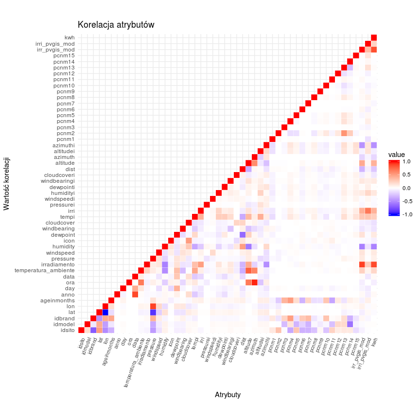
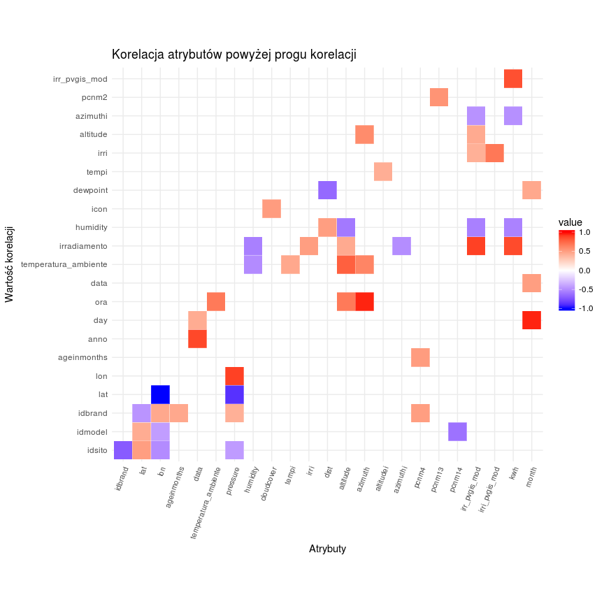
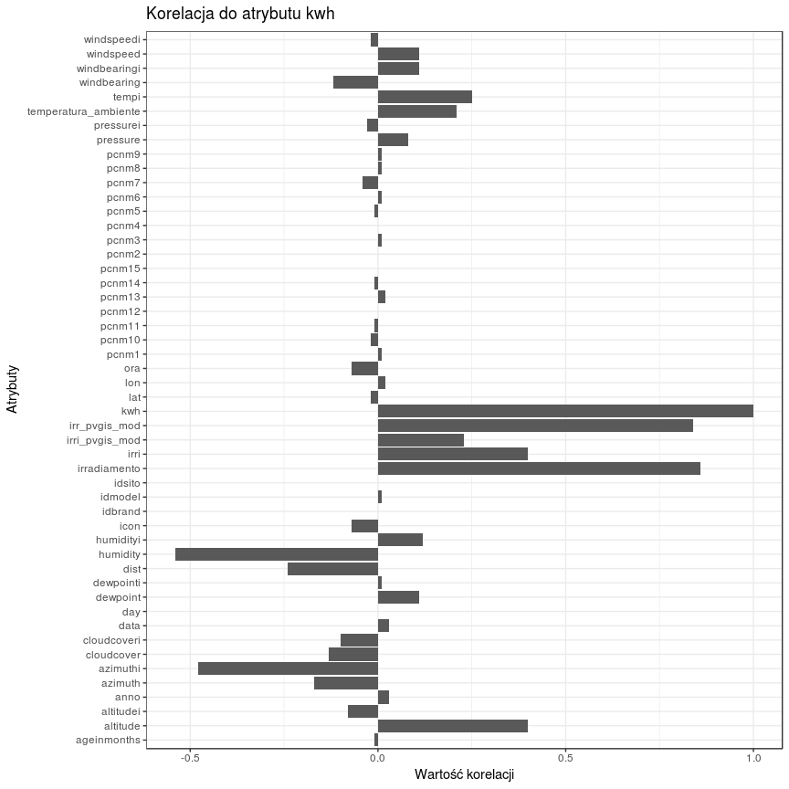
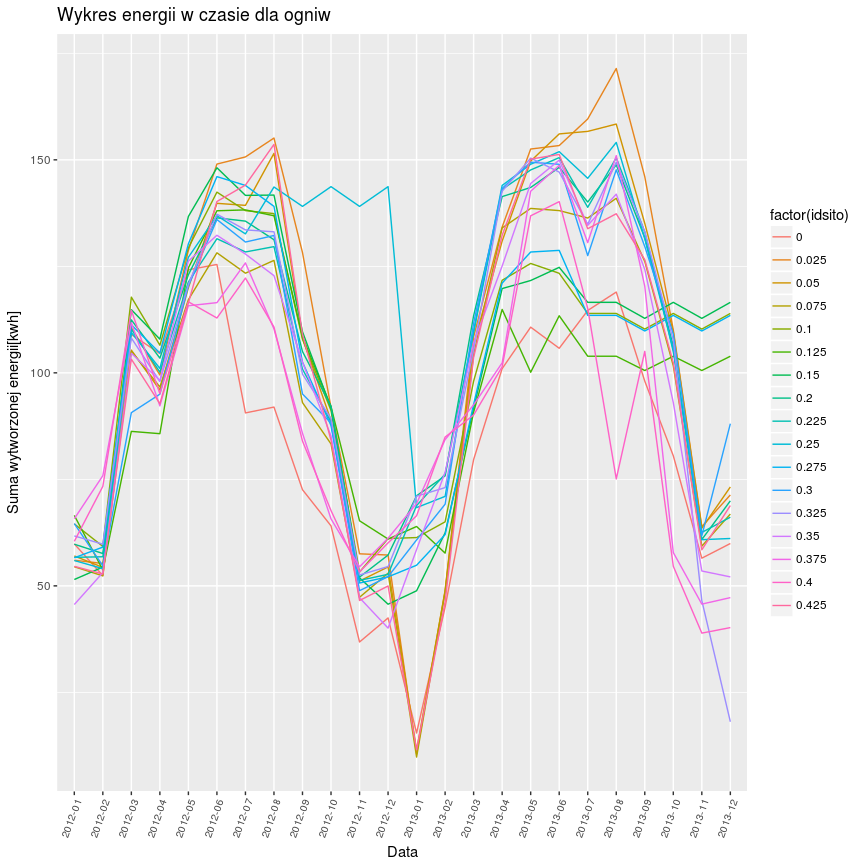

Projekt analiza danych
================
Wojciech Mikołajczyk
December 2, 2017

-   [Podsumowanie analizy](#podsumowanie-analizy)
-   [Wykorzystane biblioteki](#wykorzystane-biblioteki)
-   [Podsumowanie danych w zbiorze](#podsumowanie-danych-w-zbiorze)
-   [Opis danych](#opis-danych)
-   [Przygotowanie danych](#przygotowanie-danych)
-   [Korelacja zmiennych](#korelacja-zmiennych)
-   [Wykres - zmiana wytwarzanej energii przez ogniwa w czasie i
    przestrzeni](#wykres---zmiana-wytwarzanej-energii-przez-ogniwa-w-czasie-i-przestrzeni)
-   [Regresor](#regresor)

### Podsumowanie analizy

W analizowanym zbiorze danych pomimo dużej liczby atrybutów, tylko kilka
z nich jest silnie skorelowanych z ilością wytwarzanej energii przez
ogniwa fotowoltaiczne. Wszystkie wartości numeryczne są znormalizowane,
przez co odczytanie i interpretacja wartości kolumn opisujących dni, czy
godziny wymagało przejrzenia zmienności tych wartości w zbiorze oraz ich
zależności względem innych kolumn.  
Dane opisują pomiary z 17 ogniw fotowoltaicznych. Część pomiarów jest
błędnie odczytana jako 0, możliwe, że z powodu awarii czujnika, lub
przyczyn losowych. Najmocniej skorelowane są kolumny opisujące
promieniowanie i ilość wytwarzanej energii przez ogniwa. W tych
kolumnach wartości zerowe zostały uzupełnione w sposób bazujący na
wartości drugiej skorelowanej kolumny.  
Na wykresie przedstawiającym ilość wytworzonej energii w osi czasu widać
wyraźnie, że w miesiącach letnich wartości są wyraźnie wyższe niż w
zimowych. Jest to zgodne z intuicyjnymi oczekiwaniami.  
Jako regresor został wykorzystany model Random Forest operujący na
danych okrojonych do najbardziej skorelowanych kolumn z kolumną 'kwh'.
Zbiór danych został podzielony na treningowy, walidujący i testujący.

### Wykorzystane biblioteki

``` r
library(dplyr)
library(ggplot2)
library(reshape2)
library(caret)
library(lubridate)
```

Zastosowanie bibliotek:  
dplyr - do przetwarzania dataframe  
ggplot2 - wykresy  
reshape2 - funkcja melt  
caret - regresor  
lubridate - funkcja month

#### Wczytanie danych z pliku .csv

``` r
power_stations <- read.csv('elektrownie.csv')
```

### Podsumowanie danych w zbiorze

#### 1. Rozmiar zbioru danych

``` r
dimensions <- dim(power_stations)
names(dimensions) <- c('l. wierszy', 'l. kolumn')
dimensions
```

    ## l. wierszy  l. kolumn 
    ##     235790         51

Zbiór danych opisany jest 51 atrybutami i składa się z 235790 wierszy

#### 2. Podstawowe statystyki

``` r
summary(power_stations)
```

    ##        id             idsito          idmodel          idbrand      
    ##  Min.   :     1   Min.   :0.0000   Min.   :0.0000   Min.   :0.0000  
    ##  1st Qu.: 99646   1st Qu.:0.1000   1st Qu.:0.1670   1st Qu.:0.0830  
    ##  Median :158594   Median :0.2250   Median :0.2080   Median :0.1670  
    ##  Mean   :152703   Mean   :0.2147   Mean   :0.2426   Mean   :0.1519  
    ##  3rd Qu.:217541   3rd Qu.:0.3250   3rd Qu.:0.2920   3rd Qu.:0.1670  
    ##  Max.   :276488   Max.   :0.4250   Max.   :0.7500   Max.   :0.4170  
    ##                                                                     
    ##       lat              lon          ageinmonths          anno     
    ##  Min.   :0.4150   Min.   :0.1540   Min.   :0.0000   Min.   :2012  
    ##  1st Qu.:0.4370   1st Qu.:0.6200   1st Qu.:0.0000   1st Qu.:2012  
    ##  Median :0.4370   Median :0.6240   Median :0.1250   Median :2012  
    ##  Mean   :0.4495   Mean   :0.5711   Mean   :0.3145   Mean   :2012  
    ##  3rd Qu.:0.4390   3rd Qu.:0.6300   3rd Qu.:0.7190   3rd Qu.:2013  
    ##  Max.   :0.5530   Max.   :0.6910   Max.   :1.0000   Max.   :2013  
    ##                                                                   
    ##       day              ora                      data       
    ##  Min.   :0.0000   Min.   :0.000   10/10/2012 10:00:    17  
    ##  1st Qu.:0.2520   1st Qu.:0.222   10/10/2012 11:00:    17  
    ##  Median :0.4770   Median :0.500   10/10/2012 12:00:    17  
    ##  Mean   :0.4812   Mean   :0.500   10/10/2012 13:00:    17  
    ##  3rd Qu.:0.7100   3rd Qu.:0.778   10/10/2012 14:00:    17  
    ##  Max.   :1.0000   Max.   :1.000   10/10/2012 15:00:    17  
    ##                                   (Other)         :235688  
    ##  temperatura_ambiente  irradiamento       pressure        windspeed      
    ##  Min.   :0.0450       Min.   :0.0000   Min.   :0.0000   Min.   :0.00000  
    ##  1st Qu.:0.2120       1st Qu.:0.0000   1st Qu.:0.7480   1st Qu.:0.04200  
    ##  Median :0.3480       Median :0.0350   Median :0.7530   Median :0.06600  
    ##  Mean   :0.3734       Mean   :0.1091   Mean   :0.6504   Mean   :0.07622  
    ##  3rd Qu.:0.5300       3rd Qu.:0.2040   3rd Qu.:0.7550   3rd Qu.:0.10200  
    ##  Max.   :0.8180       Max.   :0.7100   Max.   :0.7690   Max.   :0.69600  
    ##                                                                          
    ##     humidity           icon           dewpoint       windbearing    
    ##  Min.   :0.1600   Min.   :0.0000   Min.   :0.1390   Min.   :0.0000  
    ##  1st Qu.:0.5400   1st Qu.:0.0830   1st Qu.:0.5350   1st Qu.:0.3000  
    ##  Median :0.7000   Median :0.6670   Median :0.6190   Median :0.4780  
    ##  Mean   :0.6844   Mean   :0.4623   Mean   :0.6055   Mean   :0.4512  
    ##  3rd Qu.:0.8400   3rd Qu.:0.6670   3rd Qu.:0.6830   3rd Qu.:0.6600  
    ##  Max.   :1.0000   Max.   :0.7500   Max.   :0.8650   Max.   :0.7690  
    ##                                                                     
    ##    cloudcover        tempi             irri         pressurei       
    ##  Min.   :0.000   Min.   :0.0090   Min.   :0.108   Min.   :0.000000  
    ##  1st Qu.:0.230   1st Qu.:0.0730   1st Qu.:0.216   1st Qu.:0.000000  
    ##  Median :0.310   Median :0.1110   Median :0.220   Median :0.000000  
    ##  Mean   :0.359   Mean   :0.1225   Mean   :0.222   Mean   :0.000237  
    ##  3rd Qu.:0.510   3rd Qu.:0.1260   3rd Qu.:0.222   3rd Qu.:0.000000  
    ##  Max.   :1.000   Max.   :0.9830   Max.   :1.000   Max.   :1.000000  
    ##                                                                     
    ##    windspeedi        humidityi         dewpointi       windbearingi   
    ##  Min.   :0.00000   Min.   :0.03400   Min.   :0.0630   Min.   :0.0000  
    ##  1st Qu.:0.03700   1st Qu.:0.04400   1st Qu.:0.1140   1st Qu.:0.3360  
    ##  Median :0.03800   Median :0.04400   Median :0.1140   Median :0.3360  
    ##  Mean   :0.03852   Mean   :0.06384   Mean   :0.1194   Mean   :0.3455  
    ##  3rd Qu.:0.03900   3rd Qu.:0.06200   3rd Qu.:0.1180   3rd Qu.:0.3390  
    ##  Max.   :1.00000   Max.   :0.57900   Max.   :0.4150   Max.   :1.0000  
    ##                                                                       
    ##   cloudcoveri          dist           altitude         azimuth      
    ##  Min.   :0.0000   Min.   :0.0000   Min.   :0.1110   Min.   :0.1280  
    ##  1st Qu.:0.1960   1st Qu.:0.1913   1st Qu.:0.4190   1st Qu.:0.2950  
    ##  Median :0.1960   Median :0.4590   Median :0.5640   Median :0.4250  
    ##  Mean   :0.2062   Mean   :0.4686   Mean   :0.5464   Mean   :0.4546  
    ##  3rd Qu.:0.1980   3rd Qu.:0.7268   3rd Qu.:0.6810   3rd Qu.:0.6350  
    ##  Max.   :1.0000   Max.   :1.0000   Max.   :0.8840   Max.   :0.8180  
    ##                                                                     
    ##    altitudei         azimuthi          pcnm1            pcnm2       
    ##  Min.   :0.0000   Min.   :0.0000   Min.   :0.0000   Min.   :0.0000  
    ##  1st Qu.:0.0960   1st Qu.:0.2090   1st Qu.:0.3770   1st Qu.:0.2500  
    ##  Median :0.1360   Median :0.2880   Median :0.3780   Median :0.3770  
    ##  Mean   :0.2055   Mean   :0.3653   Mean   :0.4224   Mean   :0.3538  
    ##  3rd Qu.:0.2660   3rd Qu.:0.4820   3rd Qu.:0.3800   3rd Qu.:0.4220  
    ##  Max.   :0.9820   Max.   :1.0000   Max.   :1.0000   Max.   :0.9720  
    ##                                                                     
    ##      pcnm3            pcnm4            pcnm5            pcnm6       
    ##  Min.   :0.0000   Min.   :0.0000   Min.   :0.0000   Min.   :0.0000  
    ##  1st Qu.:0.5510   1st Qu.:0.3630   1st Qu.:0.3310   1st Qu.:0.3390  
    ##  Median :0.6050   Median :0.5310   Median :0.4270   Median :0.4930  
    ##  Mean   :0.6045   Mean   :0.5189   Mean   :0.4165   Mean   :0.4941  
    ##  3rd Qu.:0.7300   3rd Qu.:0.6340   3rd Qu.:0.4620   3rd Qu.:0.4930  
    ##  Max.   :1.0000   Max.   :1.0000   Max.   :1.0000   Max.   :1.0000  
    ##                                                                     
    ##      pcnm7            pcnm8            pcnm9            pcnm10      
    ##  Min.   :0.0000   Min.   :0.0000   Min.   :0.0000   Min.   :0.0000  
    ##  1st Qu.:0.0310   1st Qu.:0.2040   1st Qu.:0.5270   1st Qu.:0.5530  
    ##  Median :0.0520   Median :0.4120   Median :0.5320   Median :0.6190  
    ##  Mean   :0.1142   Mean   :0.4034   Mean   :0.5371   Mean   :0.6276  
    ##  3rd Qu.:0.1140   3rd Qu.:0.5110   3rd Qu.:0.6000   3rd Qu.:0.7170  
    ##  Max.   :1.0000   Max.   :1.0000   Max.   :1.0000   Max.   :1.0000  
    ##                                                                     
    ##      pcnm11           pcnm12           pcnm13           pcnm14      
    ##  Min.   :0.0000   Min.   :0.0000   Min.   :0.1370   Min.   :0.0000  
    ##  1st Qu.:0.2570   1st Qu.:0.7480   1st Qu.:0.6140   1st Qu.:0.4320  
    ##  Median :0.3270   Median :0.7600   Median :0.6140   Median :0.4730  
    ##  Mean   :0.3236   Mean   :0.7568   Mean   :0.6501   Mean   :0.4893  
    ##  3rd Qu.:0.3270   3rd Qu.:0.8840   3rd Qu.:0.7380   3rd Qu.:0.5300  
    ##  Max.   :1.0000   Max.   :1.0000   Max.   :1.0000   Max.   :1.0000  
    ##                                                                     
    ##      pcnm15       irr_pvgis_mod    irri_pvgis_mod         kwh        
    ##  Min.   :0.0000   Min.   :0.0000   Min.   :-0.0250   Min.   :0.0000  
    ##  1st Qu.:0.6120   1st Qu.:0.0000   1st Qu.: 0.1580   1st Qu.:0.0000  
    ##  Median :0.6140   Median :0.0560   Median : 0.1940   Median :0.0490  
    ##  Mean   :0.5709   Mean   :0.1767   Mean   : 0.1967   Mean   :0.1688  
    ##  3rd Qu.:0.6150   3rd Qu.:0.3250   3rd Qu.: 0.2130   3rd Qu.:0.3320  
    ##  Max.   :1.0000   Max.   :1.0000   Max.   : 1.0060   Max.   :1.0000  
    ## 

Prawie wszystkie wartości są wartościami liczbowymi, znormalizowanymi

#### 3. Sprawdzenie czy zbiór zawiera wartości NA

``` r
any(is.na(power_stations))
```

    ## [1] FALSE

Zbiór nie zawiera wartości NA, zatem nie będzie konieczne zwracanie na
ich wystąpienie uwagi przy przetwarzaniu

#### 4. Typy kolumn

``` r
sapply(power_stations, class)
```

    ##                   id               idsito              idmodel 
    ##            "integer"            "numeric"            "numeric" 
    ##              idbrand                  lat                  lon 
    ##            "numeric"            "numeric"            "numeric" 
    ##          ageinmonths                 anno                  day 
    ##            "numeric"            "integer"            "numeric" 
    ##                  ora                 data temperatura_ambiente 
    ##            "numeric"             "factor"            "numeric" 
    ##         irradiamento             pressure            windspeed 
    ##            "numeric"            "numeric"            "numeric" 
    ##             humidity                 icon             dewpoint 
    ##            "numeric"            "numeric"            "numeric" 
    ##          windbearing           cloudcover                tempi 
    ##            "numeric"            "numeric"            "numeric" 
    ##                 irri            pressurei           windspeedi 
    ##            "numeric"            "numeric"            "numeric" 
    ##            humidityi            dewpointi         windbearingi 
    ##            "numeric"            "numeric"            "numeric" 
    ##          cloudcoveri                 dist             altitude 
    ##            "numeric"            "numeric"            "numeric" 
    ##              azimuth            altitudei             azimuthi 
    ##            "numeric"            "numeric"            "numeric" 
    ##                pcnm1                pcnm2                pcnm3 
    ##            "numeric"            "numeric"            "numeric" 
    ##                pcnm4                pcnm5                pcnm6 
    ##            "numeric"            "numeric"            "numeric" 
    ##                pcnm7                pcnm8                pcnm9 
    ##            "numeric"            "numeric"            "numeric" 
    ##               pcnm10               pcnm11               pcnm12 
    ##            "numeric"            "numeric"            "numeric" 
    ##               pcnm13               pcnm14               pcnm15 
    ##            "numeric"            "numeric"            "numeric" 
    ##        irr_pvgis_mod       irri_pvgis_mod                  kwh 
    ##            "numeric"            "numeric"            "numeric"

Prawie wszystkie typy wartości określone są jako 'numeric'. W przypadku
'data' przydałaby się zamiana typu. Część wartości zakwalifikowanych
jako 'numeric' tak naprawdę jest typu 'factor' (np. idmodel -
określający model ogniwa)

#### 5. Liczba różnych wartości w kolumnach

``` r
sapply(power_stations, function(x) length(unique(x)))
```

    ##                   id               idsito              idmodel 
    ##               235790                   17                   11 
    ##              idbrand                  lat                  lon 
    ##                    6                    9                   12 
    ##          ageinmonths                 anno                  day 
    ##                    7                    2                  365 
    ##                  ora                 data temperatura_ambiente 
    ##                   19                13870                   52 
    ##         irradiamento             pressure            windspeed 
    ##                  639                   41                  367 
    ##             humidity                 icon             dewpoint 
    ##                   85                    7                  634 
    ##          windbearing           cloudcover                tempi 
    ##                  360                  101                  522 
    ##                 irri            pressurei           windspeedi 
    ##                  236                   47                  126 
    ##            humidityi            dewpointi         windbearingi 
    ##                  409                  183                  514 
    ##          cloudcoveri                 dist             altitude 
    ##                  393                  184                  773 
    ##              azimuth            altitudei             azimuthi 
    ##                  689                  935                  937 
    ##                pcnm1                pcnm2                pcnm3 
    ##                   11                   16                   13 
    ##                pcnm4                pcnm5                pcnm6 
    ##                   13                   13                   12 
    ##                pcnm7                pcnm8                pcnm9 
    ##                   13                   13                   13 
    ##               pcnm10               pcnm11               pcnm12 
    ##                   13                   13                   13 
    ##               pcnm13               pcnm14               pcnm15 
    ##                   13                   13                   11 
    ##        irr_pvgis_mod       irri_pvgis_mod                  kwh 
    ##                  870                  752                  864

``` r
ggplot(melt(lapply(power_stations[, !(names(power_stations) %in% c('id', 'data'))], function(x) length(unique(x)))), aes(x=L1, y=value)) + 
  geom_bar(stat = "identity") +
  labs(title = "Liczba różnych wartości", x = "Atrybut", y = "Liczba wartości") + 
  theme_bw() +
  theme(axis.text.x = element_text(angle = 70, size = 8, vjust = 1, hjust = 1))
```


#### 6. Rozkład wartości poszczególnych atrybutów

``` r
ggplot(data = melt(power_stations), mapping = aes(x = value)) + 
  geom_histogram(bins=50) + 
  labs(title = "Rozkład wartości atrybutów", x = "", y = "") + 
  facet_wrap(~variable, ncol=4, scales = 'free_x') + 
  scale_x_continuous(labels = scales::comma) + 
  theme_bw()
```

    ## Using data as id variables


#### 7. Liczba wartości 0 w kolumnach

``` r
sapply(power_stations, function(x) sum(x==0))
```

    ##                   id               idsito              idmodel 
    ##                    0                13870                13870 
    ##              idbrand                  lat                  lon 
    ##                41610                    0                    0 
    ##          ageinmonths                 anno                  day 
    ##                69350                    0                  304 
    ##                  ora                 data temperatura_ambiente 
    ##                12410                    0                    0 
    ##         irradiamento             pressure            windspeed 
    ##                78489                32148                 1070 
    ##             humidity                 icon             dewpoint 
    ##                    0                45617                    0 
    ##          windbearing           cloudcover                tempi 
    ##                 2520                38394                    0 
    ##                 irri            pressurei           windspeedi 
    ##                    0               233263                    2 
    ##            humidityi            dewpointi         windbearingi 
    ##                    0                    0                    1 
    ##          cloudcoveri                 dist             altitude 
    ##                    1                  570                    0 
    ##              azimuth            altitudei             azimuthi 
    ##                    0                    1                    1 
    ##                pcnm1                pcnm2                pcnm3 
    ##                13870                13870                13870 
    ##                pcnm4                pcnm5                pcnm6 
    ##                13870                13870                13870 
    ##                pcnm7                pcnm8                pcnm9 
    ##                13870                13870                13870 
    ##               pcnm10               pcnm11               pcnm12 
    ##                13870                13870                13870 
    ##               pcnm13               pcnm14               pcnm15 
    ##                    0                13870                13870 
    ##        irr_pvgis_mod       irri_pvgis_mod                  kwh 
    ##                94008                    2                78521

### Opis danych

Dane pochodzą z ogniw fotowoltaicznych umieszczonych we Włoszech.
Opisane są przy użyciu 51 atrybutów, z czego część ma nazwy angielskie,
część włoskie, a kilka z nich opisana jest skrótami.  
Wszystkie kolumny poza 'id', 'data' oraz 'anno' mają wartości liczbowe i
są znormalizowane.

Interpretacja kolumn:  
id - identyfikator  
idsito - id ogniwa fotowoltaicznego  
idmodel - id modelu ogniwa fotowoltaicznego  
idbrand - id marki ogniwa fotowoltaicznego  
lat - szerokość geograficzna ogniwa fotowoltaicznego  
lon - długość geograficzna ogniwa fotowoltaicznego  
ageinmonths - wiek ogniwa fotowoltaicznego  
anno - rok  
day - dzien (przyjmuje 365 różnych wartości, więc wszystko się zgadza)  
ora - godzina (0 dla godz. 2:00, rośnie do 1 dla godz 20:00 czyli końca
pomiarów) data - data i czas w formacie MM/DD/YYYY HH:MM, od 1/2/2012
2:00 do 12/31/2013 20:00  
temperatura\_ambiente - temperatura otoczenia  
irradiamento - promieniowanie, prawdopodobnie będzie wpływać na ilość
wytwarzanej energii  
pressure - ciśnienie  
windspeed - prędkość wiatru  
humidity - wilgotność  
icon - ikona ?  
dewpoint - temperatura punktu rosy  
windbearing - łożysko wiatrowe ?  
cloud cover - zachmurzenie  
Nazwy kolumn tempi -&gt; cloudcoveri odpowiadają kolumnom
temperatura\_ambiente -&gt; cloudcover, trudno stwierdzić w jaki sposób
ich wartości są powiązane  
dist - distance ?  
altitude - wysokość  
azimuth - azymut  
altitudei -&gt; azimuthi - odpowiedniki włoskie altitude i azimuth -
inne wartości  
pcnm1 -&gt; pcnm15 - prawdopodobnie pomiary z jakichś czujników, mają
tyle samo zer ile 'idsito' i 'idmodel' (wyjątkiem jest pcnm13) co może
wskazywać że są powiązane z ogniwami fotowoltaicznymi - odpowiednim
ogniwom odpowiadają powtarzające się wartości  
irr\_pvgis\_mod - ?  
irri\_pvgis\_mod - ?  
kwh - wytworzone Kilowatogodziny (wartości znormalizowane)

Na podstawie tego, że dla każdej godziny jest 17 pomiarów, można
wywnioskować, że pomiary pochodzą właśnie z 17 jednostek
fotowoltaicznych. Pierwsze kolumny opisują ogniwa ('idsito', 'idmodel',
'idbrand', 'lat', 'lon', 'ageinmonths').

### Przygotowanie danych

#### 1. Usunięcie niepotrzebnej kolumny id

``` r
power_stations <- power_stations[, !(names(power_stations) %in% c('id'))]
power_stations <- power_stations %>% mutate(month=month(as.POSIXct(power_stations$data, format="%m/%d/%Y %H:%M")))
```

#### 2. Uzupełnienie brakujących wartości

``` r
c(sum(power_stations$irradiamento == 0), sum(power_stations$kwh == 0))
```

    ## [1] 78489 78521

``` r
# pressure
power_stations$pressure <- ifelse(power_stations$pressure == 0, mean(power_stations$pressure), power_stations$pressure)
# irradiamento based on kwh
power_stations$irradiamento <- ifelse(power_stations$irradiamento == 0 & power_stations$kwh != 0, mean(power_stations$irradiamento), power_stations$irradiamento)
# kwh based on irradiamento
power_stations$kwh <- ifelse(power_stations$kwh == 0 & power_stations$irradiamento != 0, mean(power_stations$kwh), power_stations$kwh)
```

``` r
c(sum(power_stations$irradiamento == 0), sum(power_stations$kwh == 0))
```

    ## [1] 72864 72864

Zerowe wartości kolumn 'irradiamento' (promieniowanie) oraz 'kwh'
zostały uzupełnione średnią z danej kolumny w przypadku gdy jedna z tych
kolumn ma wartość 0 a druga ma wartość niezerową.

### Korelacja zmiennych

#### 1. Wykres korelacji między zmiennymi

``` r
power_stations_for_cor <- power_stations
power_stations_for_cor$data <- as.numeric(as.POSIXlt(power_stations$data, format="%m/%d/%Y %H:%M"))

correlations <- round(cor(power_stations_for_cor), 2)
correlations[upper.tri(correlations)] <- NA
correlations_melt <- melt(correlations, na.rm = TRUE)

ggplot(data = correlations_melt, aes(Var1, Var2, fill = value)) + 
  geom_tile(color = "white") + 
  labs(title = "Korelacja atrybutów", x = "Atrybuty", y = "Wartość korelacji") + 
  scale_fill_gradient2(low="blue", mid="white", high="red", midpoint=0, limit=c(-1,1)) + 
  theme_minimal() + 
  theme(axis.text.x = element_text(angle = 70, size = 8, vjust = 1, hjust = 1)) +
  coord_fixed()
```



#### 2. Wykres korelacji między zmiennymi dla wartości bezwzględnej korelacji &gt; 0.4 z pominięciem korelacji zmiennej względem samej siebie

``` r
top_correlatinons <- correlations_melt %>% filter(abs(value) > 0.4, Var1 != Var2)
ggplot(data = top_correlatinons, aes(Var1, Var2, fill = value)) + 
  geom_tile(color = "white") + 
  labs(title = "Korelacja atrybutów powyżej progu korelacji", x = "Atrybuty", y = "Wartość korelacji") + 
  scale_fill_gradient2(low="blue", mid="white", high="red", midpoint=0, limit=c(-1,1)) + 
  theme_minimal() + 
  theme(axis.text.x = element_text(angle = 70, size = 8, vjust = 1, hjust = 1)) +
  coord_fixed()
```



#### 3. Wykres korelacji atrybutów do kwh

``` r
kwh_correlations <- melt(correlations['kwh', ])
ggplot(data = kwh_correlations, mapping = aes(x=rownames(kwh_correlations), y=value)) + 
  geom_bar(stat="identity") + 
  labs(title = "Korelacja do atrybutu kwh", x = "Atrybuty", y = "Wartość korelacji") + 
  coord_flip() + 
  theme_bw()
```

    ## Warning: Removed 1 rows containing missing values (position_stack).



### Wykres - zmiana wytwarzanej energii przez ogniwa w czasie i przestrzeni

``` r
power_stations <- power_stations %>% mutate(date_year_month=format(as.POSIXct(data, format='%m/%d/%Y %H:%M'), "%Y-%m"))
energy_sito_date <- power_stations %>% group_by(date_year_month, idsito) %>% summarise(sum_kwh=sum(kwh))
ggplot(data = energy_sito_date, mapping = aes(x=date_year_month, y=sum_kwh, color=factor(idsito), group=factor(idsito))) + 
  geom_line() +
  labs(title = "Wykres energii w czasie dla ogniw", x = "Data", y = "Suma wytworzonej energii[kwh]") +
  theme(axis.text.x = element_text(angle = 70, size = 8, vjust = 1, hjust = 1))
```



### Regresor

``` r
set.seed(93)
power_stations_for_model <- sample_n(power_stations %>% select(idsito, irradiamento, irr_pvgis_mod, humidity, azimuthi, altitude, irri, tempi, ora, day, kwh), 50000)

set.seed(93)
inTraining <- 
    createDataPartition(
        y = power_stations_for_model$idsito,
        p = .85,
        list = FALSE)

training <- power_stations_for_model[ inTraining,]

validation_testing <- power_stations_for_model[-inTraining,]
validation_testing <- split(validation_testing, rep(c('validation', 'testing'), each=nrow(validation_testing)/2))
```

    ## Warning in split.default(x = seq_len(nrow(x)), f = f, drop = drop, ...):
    ## data length is not a multiple of split variable

``` r
validation <- validation_testing$validation
testing  <- validation_testing$testing

ctrl <- trainControl(
    method = "repeatedcv",
    number = 2,
    repeats = 2)

set.seed(93)
my_model <- train(kwh ~ .,
             data = training,
             method = "rf",
             trControl = ctrl,
             ntree = 25)
```

    ## randomForest 4.6-12

    ## Type rfNews() to see new features/changes/bug fixes.

    ## 
    ## Attaching package: 'randomForest'

    ## The following object is masked from 'package:ggplot2':
    ## 
    ##     margin

    ## The following object is masked from 'package:dplyr':
    ## 
    ##     combine

``` r
my_model
```

    ## Random Forest 
    ## 
    ## 42501 samples
    ##    10 predictors
    ## 
    ## No pre-processing
    ## Resampling: Cross-Validated (2 fold, repeated 2 times) 
    ## Summary of sample sizes: 21251, 21250, 21251, 21250 
    ## Resampling results across tuning parameters:
    ## 
    ##   mtry  RMSE        Rsquared   MAE       
    ##    2    0.06958317  0.8903606  0.03588139
    ##    6    0.06853400  0.8933953  0.03422282
    ##   10    0.06950078  0.8903002  0.03444900
    ## 
    ## RMSE was used to select the optimal model using  the smallest value.
    ## The final value used for the model was mtry = 6.

``` r
my_pred <- predict(my_model, newdata = validation)
defaultSummary(data.frame(pred = my_pred, obs = validation$kwh))
```

    ##       RMSE   Rsquared        MAE 
    ## 0.06504964 0.90127669 0.03176212

``` r
my_pred <- predict(my_model, newdata = testing)
defaultSummary(data.frame(pred = my_pred, obs = testing$kwh))
```

    ##       RMSE   Rsquared        MAE 
    ## 0.06884727 0.89189330 0.03227339

Jako model wybrano Random Forest. Do utworzenia regresora zostały
wykorzystane mocno skorelowane atrybuty z atrybutem wynikowym 'kwh'.
Strojenie parametrów modelu odbyło się w oparciu o walidacyjny zbiór
danych. Celem strojenia było uzyskanie jak najmniejszej wartości RMSE.
